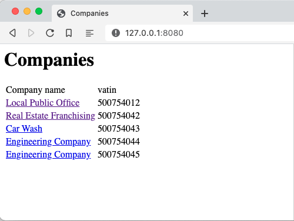
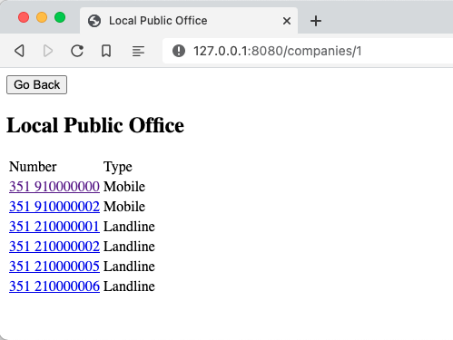
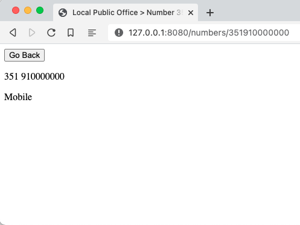

# Frontend Project

This is an assessment project, its composed of a demo api and a demo website. With the demo api you should build a react version of the demo website to the best of your ability.

## Installation

Before install, You should have this tool to run the application:

| Tool                              | Version |
| --------------------------------- | ------- |
| [Node.js](https://nodejs.org/en/) | >= 14.x |

> This project uses [Vite](https://vitejs.dev).

In the terminal of your preference, go to the _root directory_ and then run the command below to install dependencies:

```bash
npm install
```

## Usage

The project contains three main features.

### Company list



Table with company names and [vatin](https://www.startech.com/en-us/faq/vat-number) numbers.

> _Not all companies have phone numbers. E.g. "Car Wash"._

### Company details



Table with companies numbers and types (_Landline or Mobile_).

### Numbers details



Details about the company number and its type.

## Running

It's important to mention that the **React app** and **API** both should be running.

### React app

To start the React app on development environment, run the command below:

```bash
npm run dev
```

You should then have the React app running on http://localhost:3000

or

If your already generate a [Build](#build) for production environment, just run this:

```bash
npm run preview
```

You should then have the React app running on http://localhost:4173

### API

The REST API is based on [json-server](https://www.npmjs.com/package/json-server), and the data is defined in [db.json](data/db.json) file. To start it simply run:

```bash
npm run api
```

You should then have the API running on http://localhost:5000

## Build

To build the React app for production environment, you should run the following command:

```bash
npm run build
```

## Testing

This project has implemented unit tests for componentes and pages using [Vitest](https://vitest.dev). It's also has a coverage report.

To see the unit tests on _watch mode_, run the command below:

```bash
npm test
```

If you want to see the coverage report, run this:

```bash
npm run coverage
```

## License

Unlicensed.
